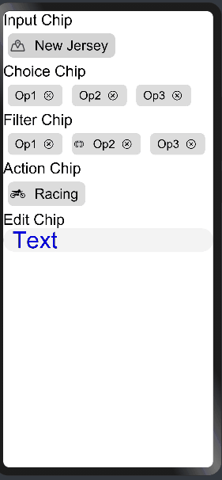

# Material_Chip
一Chips library for OpenHarmony
## Adding Dependencies
Add the following dependency in entry/package.json

```
"dependencies": {
    "@ohos/materialchips": "file:./materialchips"
  }
```
## Usage Instructions

### -Input Chip

Input chips represent information used in fields, such as an entity or different attributes.


```
Import:

import { InputChip } from '@ohos/materialchips'

Usage:

@Entry
@Component
struct Index {
  private input: InputChip.Model = new InputChip.Model()
  aboutToAppear() {
    this.input.setText("New Jeresy").setTextSize('24fp').setImage($r('app.media.Location')).setImageSize('26vp').setChipColor('#D3D3D3').setBorderRadius('10vp')
  }
  build() {
    Column() {
      Flex({justifyContent: FlexAlign.Start}) {
        InputChip({
          model: this.input
        })
      }
    }.alignItems(HorizontalAlign.Start)
    .width('100%')
  }
}
```
### -Choice Chip
In sets that contain at least two options, choice chips represent a single selection.


```
Import:

import { ChipSet, ChoiceChip } from '@ohos/materialchips'

Usage:

@Entry
@Component
struct Index {
  private choice: ChipSet.Model = new ChipSet.Model()
  @State choseChip: number = -1
  private Set: ChipSet [] = [
    new ChipSet(1, "Op1"),
    new ChipSet(2, "Op2"),
    new ChipSet(3, "Op3")
  ]
  aboutToAppear() {
    this.choice.setItems(this.Set)
  }
  build() {
    Column() {
      Flex({ justifyContent: FlexAlign.Start }) {
        ChoiceChip({
          choice: this.Set,
          chosenChipId: $choseChip,
          model: this.choice
        })
      }
    }
    .width('100%')
  }
}
```
### -Filter Chip
Filter chips represent filters for a collection.


```
Import:

import { FilterChip } from '@ohos/materialchips'

Usage:

@Entry
@Component
struct Index {
  private filter1: FilterChip.Model = new FilterChip.Model()
  private filter2: FilterChip.Model = new FilterChip.Model()
  private filter3: FilterChip.Model = new FilterChip.Model()
  aboutToAppear() {
    this.filter1.setText("Op1").setTextSize('20fp')
    this.filter2.setText("Op2").setTextSize('20fp')
    this.filter3.setText("Op3").setTextSize('20fp')
  }
  build() {
    Column() {
      Flex({justifyContent: FlexAlign.Start}) {
        FilterChip({
          model: this.filter1
        })
        FilterChip({
          model: this.filter2
        })
        FilterChip({
          model: this.filter3
        })
      }
    }.alignItems(HorizontalAlign.Start)
    .width('100%')
  }
}
```
### -Action Chip
Action chips trigger actions related to primary content.


```
Import:

import { ActionChip } from '@ohos/materialchips'

Usage:

@Entry
@Component
struct Index {
  private action: ActionChip.Model = new ActionChip.Model()
  aboutToAppear() {
    this.action.setText("Racing").setTextSize('24fp').setImage($r('app.media.Bike')).setImageSize('26vp').setBorderRadius('10vp')
  }
  build() {
    Column() {
      Flex({justifyContent: FlexAlign.Start}) {
        ActionChip({
          model: this.action
        })
      }
    }.alignItems(HorizontalAlign.Start)
    .width('100%')
  }
}
```
### -Edit Chip
The content of these chips can be edited.


```
Import:

import { EditChip } from '@ohos/materialchips'

Usage:

@Entry
@Component
struct Index {
  private edit: EditChip.Model = new EditChip.Model()
  aboutToAppear() {
    this.edit.setTextSize('24fp').setTextColor(Color.Blue)
  }
  build() {
    Column() {
      Flex({justifyContent: FlexAlign.Start}) {
        EditChip({
          model: this.edit
        })
      }
    }.alignItems(HorizontalAlign.Start)
    .width('100%')
  }
}
```
## Demo

## Compatibility
Supports OpenHarmony API version 8 and above
## Directory
```
|---- MaterialChip
|     |---- entry  # sample app usage
|     |---- materialchips  # Chips library
|           |----src 
|             |----main 
|               |----ets
|                   |----components
|                       |----MainPage
|                           |---- ActionChip.ets  # Action Chip
|                           |---- ChoiceChip.ets  # Choice Chip
|                           |---- EditChip.ets  # Edit Chip
|                           |---- FilterChip.ets  # Filter Chip
|                           |---- InputChip.ets  # Input Chip
|     |---- README.MD  # installation and usage
```
## Code Contribution
If you find any problems during usage, you can submit an [Issue](https://github.com/Applib-OpenHarmony/Material_UI_Chips/issues) to us. Of course, we also welcome you to send us [PR](https://github.com/Applib-OpenHarmony/Material_UI_Chips/pulls).

## Open source License
This project is based on [Apache License 2.0](https://github.com/applibgroup/applibgroup/blob/main/LICENSE), please enjoy and participate in open source freely.
